# Mermaid Cheat Sheet

Comprehensive reference for Mermaid diagram syntax.

## Usage in Markdown

In markdown, use the following syntax to create mermaid diagrams:

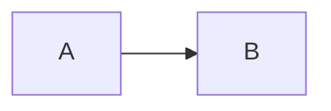

## 1. Flowcharts

A flowchart (declared with `graph`) is a type of diagram that represents an algorithm, workflow or process. The flowchart shows the steps as boxes of various kinds, and their order by connecting the boxes with arrows.

### 1.1 Graph Direction

Syntax:

```
graph [TB|BT|RL|LR|TD]
```

Possible directions are:

* `TB` or `TD` - top to bottom (default)
* `BT` - bottom to top
* `RL` - right to left
* `LR` - left to right

**Examples:**

* Top to bottom

    ```mermaid
    graph TB;
        A-->B;
    ```

* Bottom to top

    ```mermaid
    graph BT;
        A-->B;
    ```

* Right to left

    ```mermaid
    graph RL;
        A-->B;
    ```

* Left to right

    ```mermaid
    graph LR;
        A-->B;
    ```

### 1.2 Nodes & shapes

Nodes can be defined with an ID and optional text in a specific shape.

**Syntax:**

* Default (Rectangle): `id[Text]` or simply `id` if no text needed initially.
* Stadium: `id(Text)`
* Circle: `id((Text))`
* Asymmetric: `id>Text]`
* Rhombus (Diamond): `id{Text}`
* Hexagon: `id{{Text}}`
* Parallelogram: `id[/Text/]`
* Trapezoid: `id[\Text\]`
* Using FontAwesome Icons: `id[fa:fa-icon Text]` (Requires FontAwesome support in renderer)

**Examples:**

* Simple node (Default):

    ```mermaid
    graph LR;
        id;
    ```

* Rectangle with text:

    ```mermaid
    graph LR;
        id1[This is the text in the box]
    ```

* Stadium-shaped node (rounded edges):

    ```mermaid
    graph LR;
        id1(This is the text in the box)
    ```

* Circle node:

    ```mermaid
    graph LR;
        id1((This is the text in the circle))
    ```

* Asymmetric shape:

    ```mermaid
    graph LR;
        id1>This is the text in the box]
    ```

* Diamond shape (rhombus):

    ```mermaid
    graph LR;
        id1{This is the text in the box}
    ```

* Hexagonal node:

    ```mermaid
    graph LR;
        id1{{This is the text in the hexagon}}
    ```

* Parallelogram(with two different styles `\` and `/`):

    ```mermaid
    graph LR;
        id1[\This is the text in the parallelogram\]
    ```

    or

    ```mermaid
    graph LR;
        id1[/This is the text in the parallelogram/]
    ```

* Trapezoid(with two different styles `\` and `/`):

    ```mermaid
    graph LR;
        id1[/This is the text in the trapezoid\]
    ```

    or

    ```mermaid
    graph LR;
        id1[\This is the text in the trapezoid/]
    ```

### 1.3 Links Between Nodes

Links connect nodes, optionally with text and different styles.

**Syntax:**

* Arrow: `A-->B`
* Open Link: `A---B`
* Text (Style 1): `A-- Text ---B` or `A-->|Text|B`
* Text (Style 2): `A---|Text|B` or `A-- Text -->B`
* Dotted Arrow: `A-.->B`
* Dotted Text: `A-. Text .-> B`
* Thick Arrow: `A ==> B`
* Thick Text: `A == Text ==> B`

**Examples:**

* Arrow head link:

    ```mermaid
    graph LR;
        A-->B
    ```

* Open link (no arrow):

    ```mermaid
    graph LR;
        A---B
    ```

* Link with text (style 1):

    ```mermaid
    graph LR;
        A-- This is the text ---B
    ```

* Link with text (style 2):

    ```mermaid
    graph LR;
        A---|This is the text|B
    ```

* Arrow with text (style 1):

    ```mermaid
    graph LR;
        A-->|text|B
    ```

* Arrow with text (style 2):

    ```mermaid
    graph LR;
        A-- text -->B
    ```

* Dotted line with arrow:

    ```mermaid
    graph LR;
        A-.->B;
    ```

* Dotted line with text:

    ```mermaid
    graph LR;
        A-. text .-> B
    ```

* Thick line with arrow:

    ```mermaid
    graph LR;
        A ==> B
    ```

* Thick line with text:

    ```mermaid
    graph LR;
        A == text ==> B
    ```

### 1.4 Subgraphs

Syntax:

```
subgraph title
    graph definition
end
```

Example:

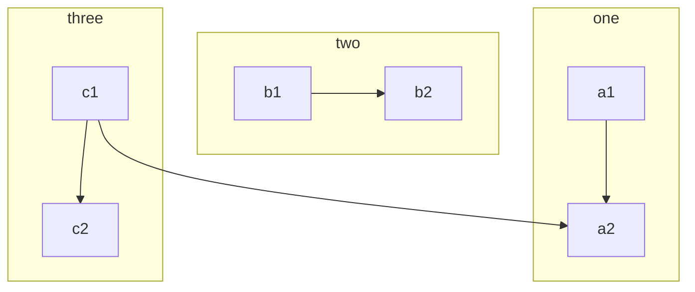

### 1.5 Styling and Classes

Define styles using `classDef` and apply them using `class`.

**Syntax:**

```
classDef className styleProperty:value[,styleProperty:value];
class node1[,node2] className;
```

**Example:**

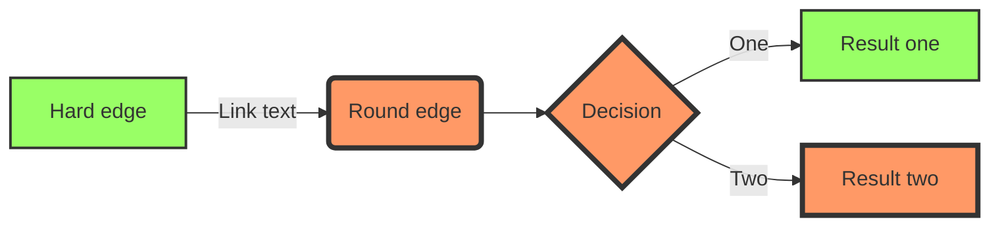

## 2. Sequence Diagrams

A Sequence diagram (declared with `sequenceDiagram`) is an interaction diagram that shows how processes operate with one another and in what order.

### 2.1 Participants

Define participants (actors) explicitly using `participant` or implicitly.

**Syntax:**

```
participant [Actor]
```

**Examples:**

The participants or actors are rendered in order of appearance in the diagram source text.

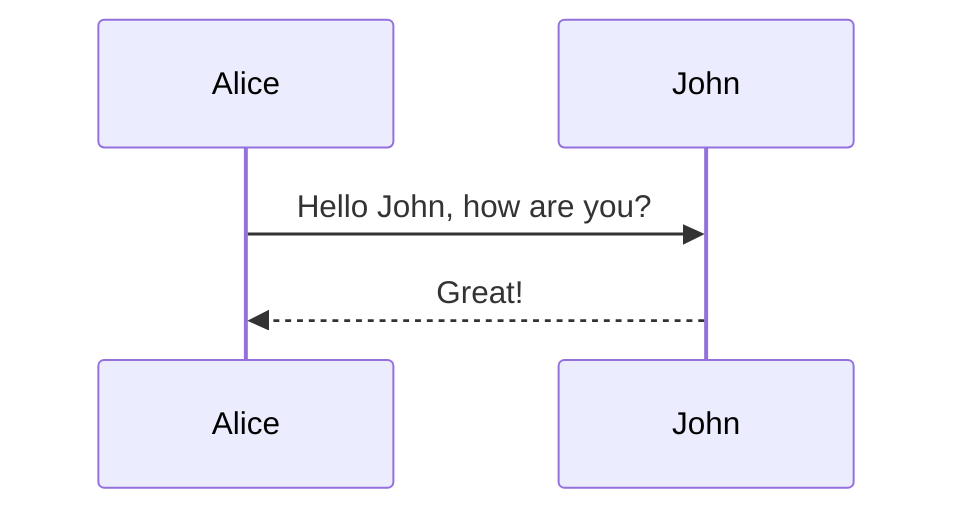

You can specify the actor's order of appearance to show the participants in a different order.

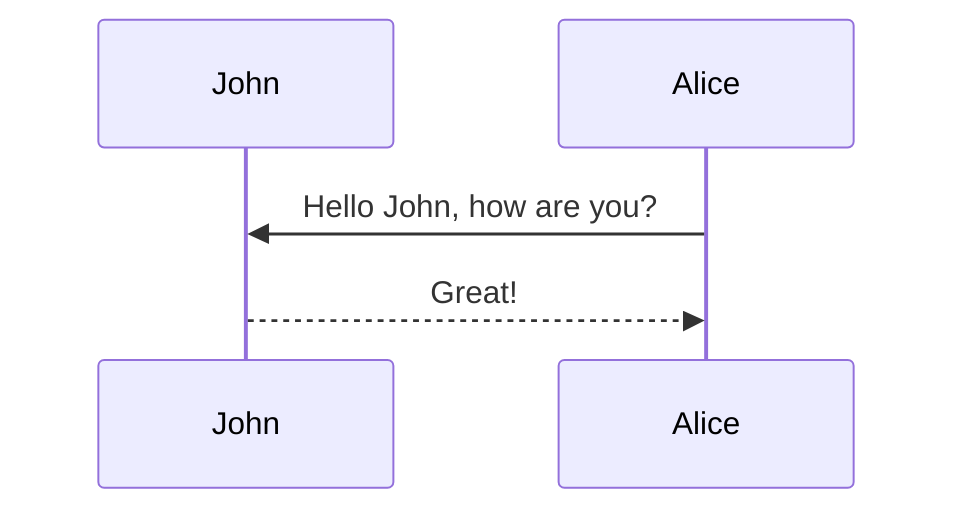

The participants can be defined implicitly without specifying them with the `participant` keyword.


### 2.2 Aliases

Assign shorter aliases to participants using `as`.

**Syntax:**

```
participant [Identifier] as [Alias Name]
```

**Example:**


### 2.3 Messages

Show interactions between participants.

**Syntax:**

```
[Actor][Arrow][Actor]:Message text
```

**Arrow Types:**

* Solid line: `->`
* Dotted line: `-->`
* Solid arrowhead: `->>`
* Dotted arrowhead: `-->>`
* Solid async cross: `-x`
* Dotted async cross: `--x`

**Examples:**

* Solid line without arrow:

    ```mermaid
    sequenceDiagram
        A->B: Text
    ```

* Dotted line without arrow:

    ```mermaid
    sequenceDiagram
        A-->B: Text
    ```

* Solid line with arrowhead:

    ```mermaid
    sequenceDiagram
        A->>B: Text
    ```

* Dotted line with arrowhead:

    ```mermaid
    sequenceDiagram
        A-->>B: Text
    ```

* Solid line with a cross at the end (async):

    ```mermaid
    sequenceDiagram
        A-xB: Text
    ```

* Dotted line with a cross at the end (async):

    ```mermaid
    sequenceDiagram
        A--xB: Text
    ```

### 2.4 Activations

Show when a participant is active using `activate`/`deactivate` or shortcuts.

**Syntax:**

```
activate [Actor]
...messages...
deactivate [Actor]

// Shortcut syntax
[Actor]->>+[Actor]: Message activating receiver
[Actor]-->>-[Actor]: Message deactivating receiver
```

**Examples:**

Activate and deactivate an actor.

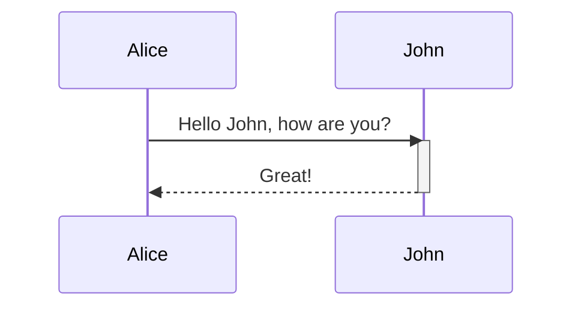

Shortcut notation by appending `+/-` suffix to the message arrow.

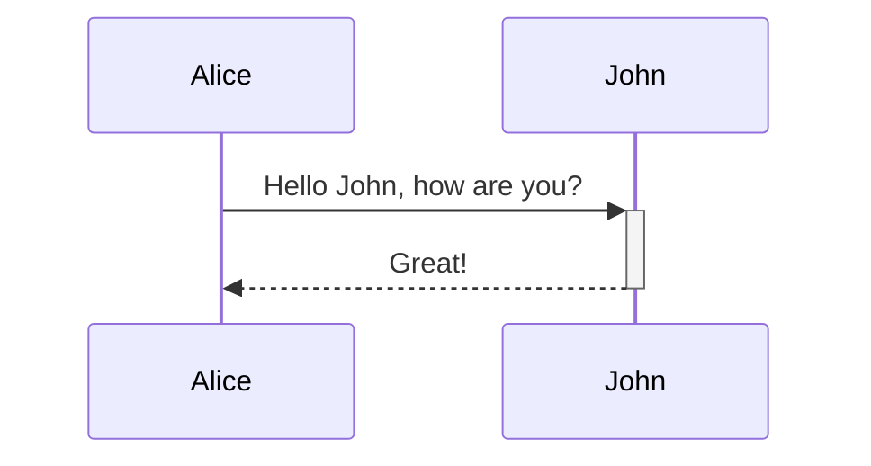

Activations can be stacked for same actor:

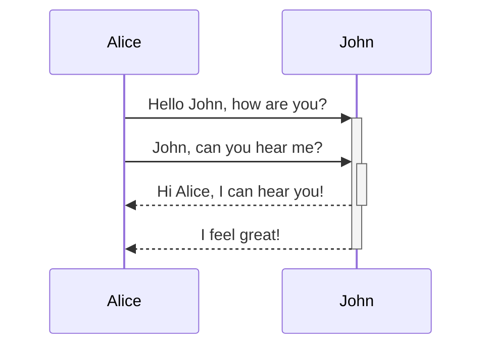

### 2.5 Notes

Add explanatory notes relative to participants using `Note`.

**Syntax:**

```
Note [ right of | left of | over ] [Actor1][,[Actor2]]: Text in note
```

**Examples:**

1. Right Side

    ```mermaid
    sequenceDiagram
        participant John
        Note right of John: Text in note
    ```

2. Left Side

    ```mermaid
    sequenceDiagram
        participant John
        Note left of John: Text in note
    ```

3. Over

    ```mermaid
    sequenceDiagram
        participant John
        Note over John: Text in note
    ```

4. Create notes spanning two participants

    ```mermaid
    sequenceDiagram
        Alice->>John: Hello John, how are you?
        Note over Alice,John: A typical interaction
    ```

### 2.6 Loops

Represent repetitive sequences using `loop`.

Syntax:

```
loop Loop description
... statements ...
end
```

Example:

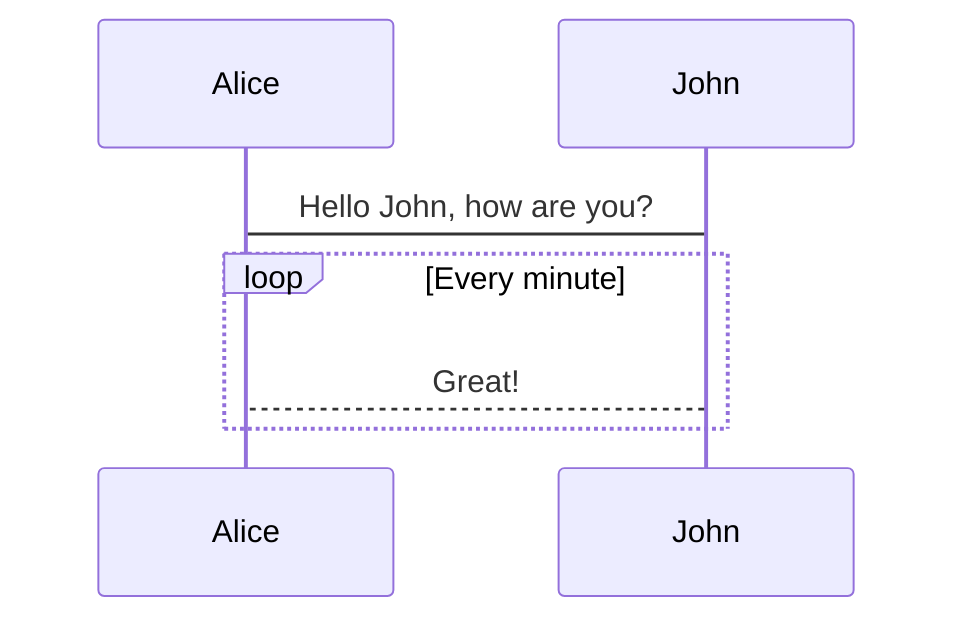

### 2.7 Alt

Represent alternative (`alt`) or optional (`opt`) sequences.

Syntax (Alternative):

```
alt Describing text
... statements ...
else Another description
... statements ...
end
```

Syntax (Optional):

```
opt Describing text
... statements ...
end
```

Example:

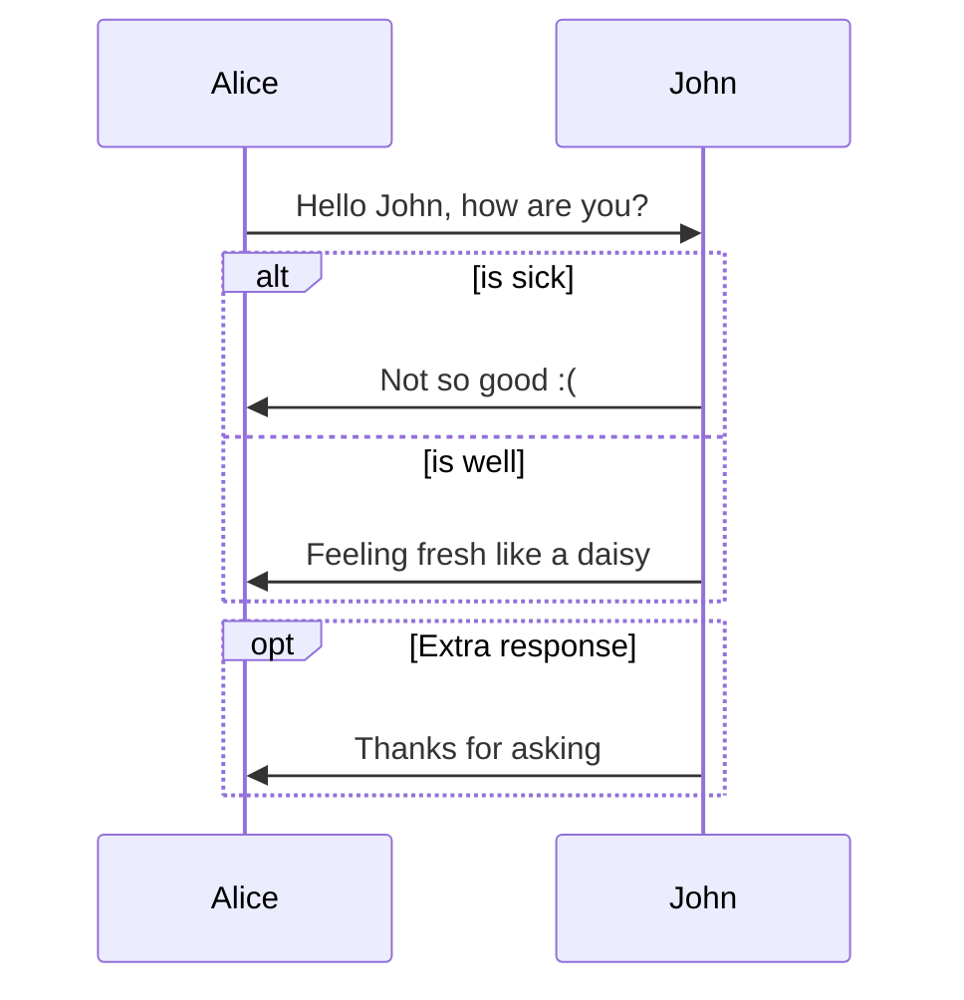

## 3. Gantt Diagrams

A Gantt chart (declared with `gantt`) is a type of bar chart that illustrates a project schedule. Gantt charts illustrate the start and finish dates of the terminal elements and summary elements of a project.

### 3.1 Basic Syntax

**Syntax:**

```mermaid
gantt
    title [Chart Title]
    dateFormat [Format] // e.g., YYYY-MM-DD
    section [Section Name]
    [Task Description] :[crit?],[active?],[done?],[task_id?], [start_date|after task_id], [duration|end_date]
    section [Another Section]
    ...
```

**Example:**

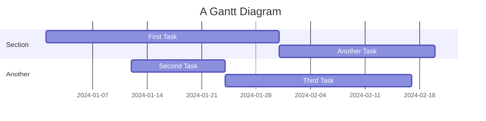

### 3.2 Extended Syntax

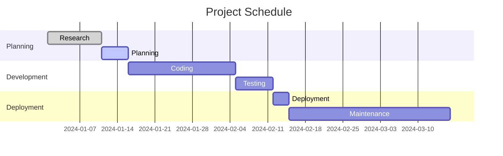

### 3.3 Special Task Types

Use keywords before the task ID:

* `done` - Completed task
* `active` - Currently active task
* `crit` - Critical task

## 4. Class Diagrams

Class diagrams (declared with `classDiagram`) are used to represent class-based programming structures.

### 4.1 Basic Syntax

**Syntax:**

```
classDiagram
    class ClassName {
        +[visibility]attributeName: type
        -[visibility]methodName(params): returnType
        #visibilityModifier
    }
    // Relationships defined below
```

**Example:**

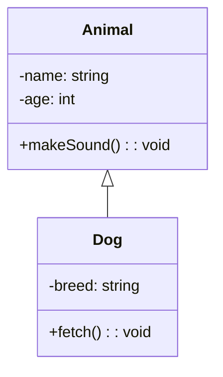

### 4.2 Relationships

Define relationships between classes using specific arrows.

**Syntax:** `ClassA [Arrow] ClassB : [Label]`

**Relationship Types & Arrows:**

* Inheritance: `<|--`
* Composition: `*--`
* Aggregation: `o--`
* Association: `-->` or `--`
* Link (Solid): `--`
* Dependency: `..>` or `..*`
* Realization: `..|>`

**Examples:**

* Inheritance - `<|--` - Dog inherits from Animal

    ```mermaid
    classDiagram
        Animal <|-- Dog
    ```

* Composition - `*--` - Car has an Engine

    ```mermaid
    classDiagram
    Car *-- Engine
    ```

* Aggregation - `o--` - Library has Books

    ```mermaid
    classDiagram
        Library o-- Book
    ```

* Association - `-->` - Student takes Courses

    ```mermaid
    classDiagram
        Student --> Course
    ```

* Link - `--` - General relationship

    ```mermaid
    classDiagram
        Person -- Animal
    ```

* Dependency - `..>` - Model depends on Controller

    ```mermaid
    classDiagram
        Model ..> Controller
    ```

* Realization - `..|>` - Square implements Shape

    ```mermaid
    classDiagram
        Shape <|.. Square
    ```

## 5. Entity-Relationship Diagrams

ER diagrams (declared with `erDiagram`) describe entities and their relationships, often used for database modeling.

### 5.1 Basic Syntax

**Syntax:**

```
erDiagram
    ENTITY1 [Cardinality]--[Cardinality] ENTITY2 : relationshipLabel
```

**Example:**

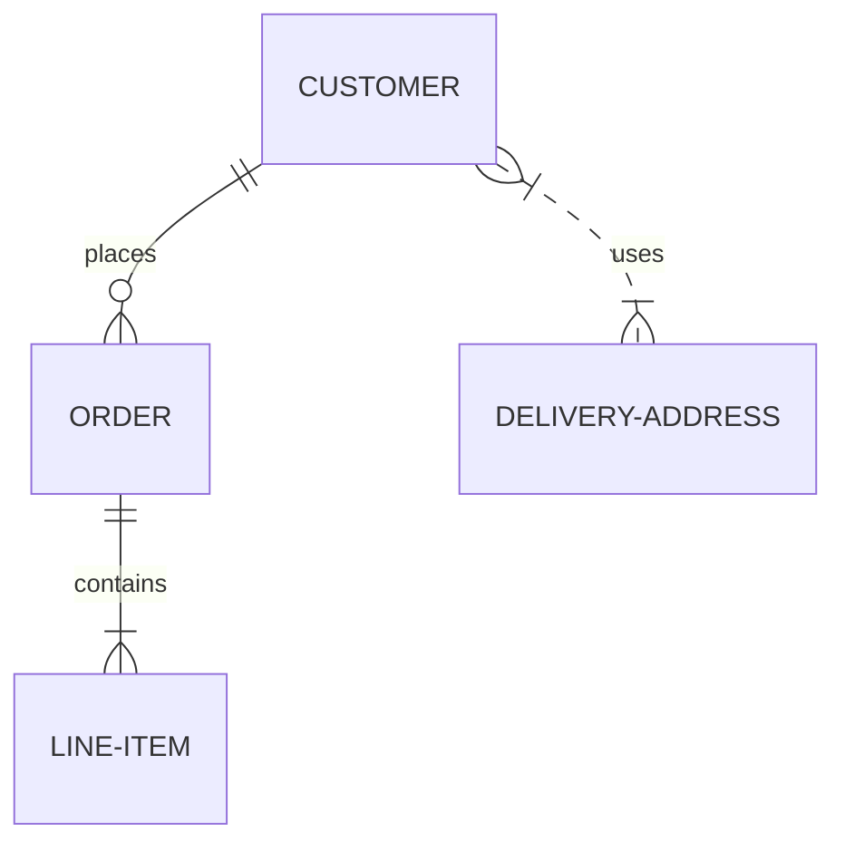

### 5.2 Relationship Types

Cardinality symbols define the relationship constraints:

* `|o` : Zero or One
* `||` : Exactly One
* `}o` : Zero or More (Many)
* `}|` : One or More (Many)

**Common Combinations:**

* One-to-exactly-one: `||--||`
* One-to-zero-or-many: `||--o{`
* One-to-one-or-many: `||--|{`
* Zero-or-more-to-zero-or-more: `}o--o{`
* One-or-more-to-one-or-more: `}|--|{`
* Zero-or-more-to-exactly-one: `}o--||`

**Examples:**

* One-to-one - `||--||` - One to exactly one

    ```mermaid
    erDiagram
        PERSON ||--|| PASSPORT : has
    ```

* One-to-many - `||--o{` - One to zero or many

    ```mermaid
    erDiagram
        TEACHER ||--o{ STUDENT : teaches
    ```

* Many-to-one - `}o--||` - Many to one

    ```mermaid
    erDiagram
        BOOK }o--|| AUTHOR : written_by
    ```

* Many-to-many - `}o--o{` - Many to many

    ```mermaid
    erDiagram
        STUDENT }o--o{ COURSE : enrolls_in
    ```

## 6. State Diagrams

State diagrams (declared with `stateDiagram-v2`) describe the states of a system and the transitions between them. `[*]` represents the start and end points.

### 6.1 Basic Syntax

**Syntax:**

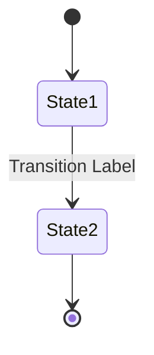

**Example:**

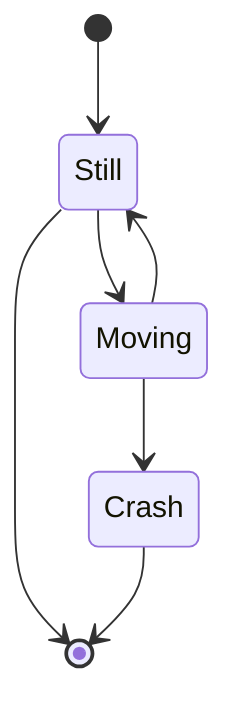

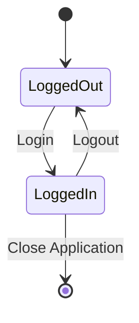

## 7. Pie Charts

Pie charts (declared with `pie`) for simple data visualizations.

**Syntax:**

```
pie
    title [Chart Title]
    "Label 1" : value1
    "Label 2" : value2
```

**Example:**

```mermaid
pie
    title Distribution of Time
    "Development" : 40
    "Testing" : 20
    "Documentation" : 15
    "Meetings" : 25
```

## 8. Common Issues and Important Tips

1. **Proper Code Fencing**: Always use triple backticks with the `mermaid` tag (e.g., ` ```mermaid `).
2. **Newlines**: Use `<br>` for line breaks inside node text, notes, and labels.
3. **Spacing**: Mermaid can be sensitive to spacing and indentation, especially in complex diagrams like sequence diagrams or state diagrams with nested states.
4. **Escaping Characters**: Use quotes (`"`) around text containing special characters like `(`, `)`, `#`, `;` to ensure they are treated as text. Example: `id["Node text with (parentheses)"]`
5. **Comments**: Use `%%` to add comments within the Mermaid code. These are ignored by the renderer.
6. **Flowchart Direction**: For flowcharts (`graph`), use `TB` first.
7. **Pipe Characters (`|`)**: Be careful with pipe characters (`|`) in Mermaid syntax (e.g., link text `A---|Text|B`, ER cardinality `||`, `}|`) as they can conflict with Markdown table syntax. When documenting Mermaid code containing pipes, always use fenced code blocks (` ``` `) rather than attempting to put the Mermaid code directly within a Markdown table cell.
8. **FontAwesome**: Using `fa:fa-icon` syntax within node text allows embedding FontAwesome icons, but requires the rendering environment to support and load FontAwesome.

## 9. Demos

### 9.1 Basic Flowchart

```mermaid
graph LR
    A[Square Rect] -- Link text --> B((Circle))
    A --> C(Round Rect)
    B --> D{Rhombus}
    C --> D
```

### 9.2 Flowchart with Decision

```mermaid
graph TD
    A[Christmas] -->|Get money| B(Go shopping)
    B --> C{Let me think}
    C -->|One| D[Laptop]
    C -->|Two| E[iPhone]
    C -->|Three| F[fa:fa-car Car]
```

### 9.3 Larger Flowchart with Some Styling

```mermaid
graph TB
    sq[Square shape] --> ci((Circle shape))

    subgraph A
        od>Odd shape]-- Two line<br/>edge comment --> ro(Rounded<br>square<br>shape)
        di{Diamond with <br/> line break} -.-> ro
        di==>ro2(Rounded square shape)
    end

    %% Notice that no text in shape are added here instead that is appended further down
    e --> od3>Really long text with linebreak<br>in an Odd shape]

    %% Comments after double percent signs
    e((Inner / circle<br>and some odd <br>special characters)) --> f(,.?!+-*)

    cyr[Cyrillic]-->cyr2((Circle shape));

     classDef green fill:#9f6,stroke:#333,stroke-width:2px
     classDef orange fill:#f96,stroke:#333,stroke-width:4px
     class sq,e green
     class di orange
```

### 9.4 Basic Sequence Diagram

```mermaid
sequenceDiagram
    Alice ->> Bob: Hello Bob, how are you?
    Bob-->>John: How about you John?
    Bob--x Alice: I am good thanks!
    Bob-x John: I am good thanks!
    Note right of John: Bob thinks a long<br/>long time, so long<br/>that the text does<br/>not fit on a row.

    Bob-->Alice: Checking with John...
    Alice->John: Yes... John, how are you?
```

### 9.5 Message to Self in Loop

```mermaid
sequenceDiagram
    participant Alice
    participant Bob
    Alice->>John: Hello John, how are you?
    loop Healthcheck
        John->>John: Fight against hypochondria
    end
    Note right of John: Rational thoughts<br/>prevail...
    John-->>Alice: Great!
    John->>Bob: How about you?
    Bob-->>John: Jolly good!
```
